<div align="center">

# Bouquin

Tracks the books r/suggestmeabook keeps recommending

[![Live][badge-site]][url-site]
[![HTML5][badge-html]][url-html]
[![CSS3][badge-css]][url-css]
[![JavaScript][badge-js]][url-js]
[![Claude Code][badge-claude]][url-claude]
[![License][badge-license]](LICENSE)

[badge-site]:    https://img.shields.io/badge/live_site-0063e5?style=for-the-badge&logo=googlechrome&logoColor=white
[badge-html]:    https://img.shields.io/badge/HTML5-E34F26?style=for-the-badge&logo=html5&logoColor=white
[badge-css]:     https://img.shields.io/badge/CSS3-1572B6?style=for-the-badge&logo=css3&logoColor=white
[badge-js]:      https://img.shields.io/badge/JavaScript-F7DF1E?style=for-the-badge&logo=javascript&logoColor=black
[badge-claude]:  https://img.shields.io/badge/Claude_Code-CC785C?style=for-the-badge&logo=anthropic&logoColor=white
[badge-license]: https://img.shields.io/badge/license-MIT-404040?style=for-the-badge

[url-site]:   https://bouquin.neorgon.com/
[url-html]:   #
[url-css]:    #
[url-js]:     #
[url-claude]: https://claude.ai/code

</div>

---

## Overview

Bouquin reads every new thread on r/suggestmeabook, pulls the books people name in the comments, and shows them as a cover grid you can sort by newest, trending or most suggested, and filter by genre. Each title is matched against Open Library before it appears, which is where the cover, the year and the genre come from, and each card links back to the exact comments that named it. Reddit closed self-service API registration in late 2025, so the reader runs on a public Reddit archive by default and switches to the official API the moment a registered app's credentials are set on the deployment.

**Live:** bouquin.neorgon.com

---

## Features

- **Three sorts** -- newest (last time a comment named it), trending (mentions in the last seven days), most suggested (all-time count)
- **Genre pills** -- fourteen categories mapped from Open Library subjects, with live counts
- **Repeat counter** -- the badge on each cover is how many distinct comments named the book
- **Counter-suggestions** -- a reply that names a different book than the comment above it is kept as "instead of …" on the book's page
- **Title search** -- full-text over resolved titles, mirrored in the URL hash like every other view
- **Provenance on every card** -- the detail sheet quotes one sentence per mention and links the thread and the comment
- **Two ingest sources, one pipeline** -- Reddit's Data API over app-only OAuth when `REDDIT_*` env vars exist, the Arctic Shift archive otherwise
- **History backfill** -- a chunked, self-scheduling action seeds any number of past days through the same extractor

---

## Running locally

ES modules require an HTTP server (not `file://`):

```bash
make serve          # http://localhost:8883
```

The page reads the production Convex deployment named in `js/api.js`. To run the backend yourself:

```bash
npm install
npx convex dev      # provisions a dev deployment and pushes convex/
npx convex run ingest:scan '{"maxThreads": 5}'      # one archive-mode scan
npx convex run backfill:start '{"days": 7}'          # seed a week of history
```

Then point `CONVEX_URL` in `js/api.js` at the dev URL from `.env.local`.

### Reddit credentials (optional)

The cron runs without them. To read Reddit directly, run the wizard from this folder:

```bash
bash scripts/setup-reddit.sh
```

It walks through reddit.com/prefs/apps (an app created before November 2025) or the access request form, then sets `REDDIT_CLIENT_ID`, `REDDIT_CLIENT_SECRET` and `REDDIT_USER_AGENT` on the deployment with `npx convex env set`. The full procedure, including what changed on Reddit's side and when, is the `reddit-data-api-app` entry in [echeance](https://echeance.neorgon.com/#tutorials).

---

## Architecture



```
bouquin-site/
├── index.html              # App shell: hero, sort control, search, pills, grid, two modals
├── css/style.css           # Site styles under the shared tokens; the kits' CSS is vendored beside it
├── js/
│   ├── app.js              # Entry point: hash, meta, first page, reopen a linked book
│   ├── state.js            # Sort, category, query, open book; read from and written to the hash
│   ├── api.js              # Convex HTTP API client (public queries only)
│   ├── events.js           # Every listener, plus the load functions that end in a render
│   ├── render.js           # Stats line, pills, cover cards, empty states, detail sheet
│   └── utils.js            # escHtml, relTime, coverUrl, monogram
├── convex/
│   ├── schema.ts           # threads, books, mentions, shelves, lookups, counters, runs, kv
│   ├── crons.ts            # scan every 30 min, trend decay nightly
│   ├── ingest.ts           # scan: choose the source, rescan the threads that moved
│   ├── backfill.ts         # start / chunk / stop: chunked history seed from the archive
│   ├── pipeline.ts         # processThread: extract, resolve (cached), record
│   ├── extract.ts          # candidate titles from comment markdown (pure)
│   ├── resolve.ts          # Open Library match gates by confidence, subjects to categories (pure)
│   ├── reddit.ts           # OAuth token, /new listing, comment trees
│   ├── archive.ts          # Arctic Shift posts and comments search
│   ├── openlibrary.ts      # search.json with retry and pace
│   ├── store.ts            # internal mutations keeping counts, shelves and counters consistent
│   └── books.ts            # public queries: list, search, get, categories, stats
├── scripts/setup-reddit.sh # Credential wizard (human steps only)
└── docs/architecture.mmd   # Source of the diagram above
```

---

<div align="center">
<sub>Part of <a href="https://neorgon.com/">Neorgon</a></sub>
</div>
